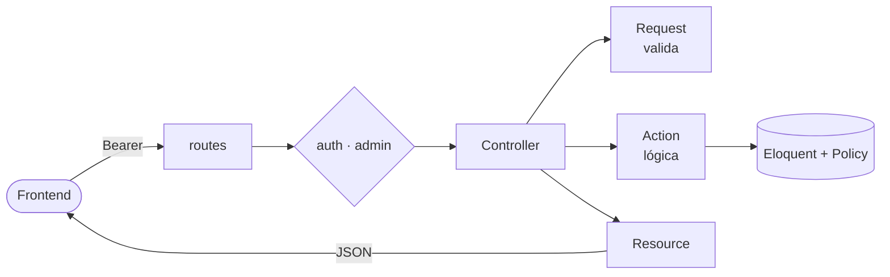

<h1 align="center">TaskFlow · API</h1>

<p align="center">
  <em>Backend REST en Laravel 10 para tareas, categorías, etiquetas y comentarios.</em><br>
  JSON bajo <code>/api/v1</code> · autenticación por token · listo para cualquier frontend.
</p>

<p align="center">
  
  
  
  
  
  
  
</p>

---

## ⚡ Quick start

```bash
composer install
cp .env.example .env && php artisan key:generate
php artisan migrate --seed          # tablas + usuarios admin y demo
php artisan serve                   # http://127.0.0.1:8000
```

> **Requiere** PHP 8.3 (extensión `pdo_pgsql`), Composer 2 y PostgreSQL 18.
> Configura `DB_*` y `FRONTEND_URL` (allowlist de CORS) en el `.env` antes de migrar.
> Las credenciales del seeder salen de `ADMIN_*` / `DEMO_*`; si dejas el `*_PASSWORD` vacío, se genera una al azar y se imprime.

### 🐳 Con Docker

```bash
docker compose up --build           # API en http://localhost:8000
```

Levanta la API (nginx + php-fpm) y PostgreSQL 18. Define `APP_KEY` y `DB_PASSWORD` en el entorno; con `RUN_MIGRATIONS=true` migra al arrancar.

## 🧭 Qué hace

🔐 Auth por token (Sanctum, login por **email**) &nbsp;·&nbsp; ✅ Tareas con **papelera** (soft delete, restaurar, borrar definitivo) &nbsp;·&nbsp; 🏷️ Categorías y etiquetas privadas por usuario &nbsp;·&nbsp; 💬 Comentarios públicos con moderación &nbsp;·&nbsp; 🛡️ Roles `admin` / `user` + catálogo de permisos &nbsp;·&nbsp; 🚦 Rate limiting &nbsp;·&nbsp; 🌐 CORS allowlist.

## 🏗️ Arquitectura

**Vertical slice**: cada entidad vive en `app/Modules/<X>/`, autocontenida. El controlador solo orquesta; la lógica va en Actions.



```
app/Modules/<Modulo>/
├── <Modulo>Controller.php   Orquesta: Request → Action → Resource
├── <Modulo>.php             Modelo Eloquent
├── routes.php               Rutas del módulo (montadas en /api/v1)
├── Actions/                 Lógica: una clase por operación
├── Requests/                Validación (contrato de entrada)
├── Resources/               Forma del JSON (contrato de salida)
├── Policies/                Permisos por recurso
├── Exceptions/              Reglas de negocio (ej. borrado con dependientes)
└── Middleware/              Solo si hace falta (ej. admin)
```

**Principios**
- Controladores finos: no consultan la BD directamente.
- El dueño (`user_id`) lo fija la Action, nunca llega desde el input.
- `role` no es asignable en masa: se asigna aparte.
- Los Resources son el contrato público; el front no ve columnas crudas.
- El manejo de errores usa excepciones propias con `render()` (JSON + código HTTP correcto).

Módulos: **Auth · Task · Category · Tag · Comment · Users · Access** (roles y permisos).

## 🛣️ Endpoints

Todos bajo `/api/v1`. **Token** = requiere `Authorization: Bearer`.

<details>
<summary><b>Ver los 45 endpoints</b></summary>

#### Auth
| Método | URL | Acceso |
| --- | --- | --- |
| POST | `/register` · `/login` | Público |
| POST | `/logout` | Token |
| GET · PUT | `/me` | Token |
| PUT | `/me/password` | Token |

#### Tareas · Categorías · Etiquetas
Mismo patrón CRUD + papelera para `/tasks`, `/categories` y `/tags`:

| Método | URL | Acceso |
| --- | --- | --- |
| GET · POST | `/{recurso}` | Token |
| GET | `/{recurso}/trashed` | Token |
| GET · PUT · DELETE | `/{recurso}/{id}` | Token |
| POST | `/{recurso}/{id}/restore` | Token |
| DELETE | `/{recurso}/{id}/force` | Token |

> `force` está protegido: eliminar definitivamente una categoría con tareas, o una etiqueta en uso, responde **409 Conflict**.

#### Comentarios
| Método | URL | Acceso |
| --- | --- | --- |
| GET | `/comments` | Público |
| POST | `/comments` | Token |
| DELETE | `/comments/{id}` | Admin |

#### Usuarios (admin)
| Método | URL | Acceso |
| --- | --- | --- |
| GET · POST | `/admin/users` | Admin |
| GET · PUT · DELETE | `/admin/users/{id}` | Admin |
| PUT | `/admin/users/{id}/password` | Admin |

#### Roles y permisos (admin)
| Método | URL | Acceso |
| --- | --- | --- |
| GET · POST | `/admin/roles` | Admin |
| GET · PUT · DELETE | `/admin/roles/{id}` | Admin |
| GET | `/admin/permissions` | Admin |

</details>

<details>
<summary><b>Modelo de datos</b></summary>

| Tabla | Campos propios | Notas |
| --- | --- | --- |
| `users` | `user_name`, `email`, `password`, `role`, `birth_date`, `avatar`, `must_change_password` | Login por email · `role`: `admin` \| `user` |
| `category` | `name`, `description`, `color`, `user_id` | Privada por usuario |
| `tag` | `name`, `description`, `color`, `user_id` | Privada · N:M con `task` vía `task_tag` |
| `task` | `title`, `description`, `status`, `priority`, `due_date`, `category_id`, `user_id` | FK categoría `set null`, pivot de tags `cascade` |
| `comments` | `body`, `user_id` | Autor nulo si se elimina |
| `roles` · `permissions` · `permission_role` | catálogo administrable | Roles `admin`/`user` protegidos |

Todas las de dominio con `timestamps` y `deleted_at` (borrado lógico).

</details>

## 🧰 Comandos útiles

```bash
php artisan route:list             # ver rutas
php artisan db:seed                # recrear admin y demo
php artisan migrate:fresh --seed   # rehacer la BD (borra datos)
./vendor/bin/pint                  # formato de código
```
